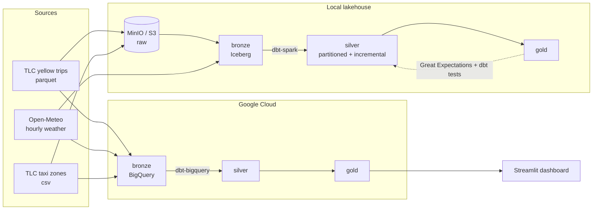

# NYC Taxi & Weather Lakehouse


An end-to-end **data lakehouse** that ingests a full year of NYC yellow-taxi trips (~40M rows), joins them to hourly NYC weather and the official taxi-zone geography, and serves analytics-ready tables — built **twice**, once on a local open-source stack (MinIO + Spark + Iceberg) and once on **Google BigQuery**, from the same dbt models.

🔗 **Live dashboard:** https://nyc-taxi-weather-lakehouse-h7tb4h8imprmlqeyaau9rh.streamlit.app/
📦 **Repo:** https://github.com/Shubhangi-Mittal/nyc-taxi-weather-lakehouse

---

## The finding: a "rain effect" that turned out to be noise

The original question was *do people tip more in bad weather?* One month of data (January 2024) said yes — riders tipped about **3 points more** in the rain. It looked like a clean, publishable result.

Then I scaled the pipeline to the **full year**, and the effect disappeared:

| Weather | Trips | Avg distance | Avg fare | Card tip % |
|---------|------:|-------------:|---------:|-----------:|
| Clear   | 33,564,958 | 3.44 mi | $19.84 | **25.1%** |
| Rain    | 5,738,055  | 3.32 mi | $19.76 | **25.3%** |
| Snow    | 414,928    | 3.14 mi | $18.23 | **25.4%** |

Across 2024, tipping holds near **25% in every condition** — a spread of 0.3 points. January's "rain bonus" was a single-month sampling artifact, not behavior. Plotted month by month, the rain-vs-clear tip gap swings above and below zero and averages out to roughly nothing.

That negative result is the point. Scaling from one month to a full year is exactly what turned an exciting-but-fragile claim into an honest one — and knowing the difference between a signal and noise is the whole job.

**Other findings that *do* hold up across the year:**
- **Manhattan is ~90% of all yellow-taxi pickups.** Yellow cabs are overwhelmingly a Manhattan service; the outer boroughs are served mostly by green cabs and app-based for-hire vehicles.
- **Queens pickups are long and expensive** — dominated by JFK and LaGuardia airport runs.
- **Ridership has a clear seasonal ramp**, climbing from ~2.9M trips in January toward ~3.6M by late spring.

---

## Architecture



The pipeline follows a **medallion** layout on both engines:

- **Bronze** — raw data landed faithfully. Locally: parquet/CSV in MinIO, registered as Iceberg tables via Spark. On the cloud: loaded into BigQuery with `bq load`.
- **Silver** — one cleaned, conformed fact table (`silver_trips_weather`): trips filtered for quality, joined to the matching weather hour and to pickup/dropoff boroughs. Locally it's **incremental and partitioned by month**; on BigQuery it's a full table.
- **Gold** — small, purpose-built marts: weather impact, borough demand, monthly volume, and a month × weather table that powers the dashboard's roll-ups.

Orchestration is handled by **Airflow** (local stack), and a **Great Expectations** gate validates the silver layer before the gold models are trusted.

### Dual-cloud, one set of models

The same dbt models run on both engines. Engine-specific SQL (timestamp parsing, hour/month keys) is isolated in a handful of macros (`dbt/macros/cross_db.sql`) that branch on `target.type`, so `dbt build` produces **identical gold tables** whether the target is Spark/Iceberg or BigQuery. The full-year gold numbers match row-for-row across both.

---

## Tech stack

| Layer | Tools |
|-------|-------|
| Language / packaging | Python 3.11, Poetry |
| Object storage | MinIO (S3-compatible), Docker Compose |
| Compute | Apache Spark 3.5 (PySpark) |
| Table format | Apache Iceberg 1.10 (JDBC/SQLite catalog) |
| Transformation | dbt 1.11 (`dbt-spark` session + `dbt-bigquery`) |
| Data quality | Great Expectations (Core 1.x) + dbt tests |
| Orchestration | Apache Airflow 3.2 |
| Cloud warehouse | Google BigQuery |
| Dashboard | Streamlit + Plotly (deployed on Streamlit Community Cloud) |

---

## Repo structure

```
nyc-taxi-weather-lakehouse/
├── docker-compose.yml              # MinIO (S3-compatible object store)
├── pyproject.toml                  # Poetry project
├── spark-conf/                     # Spark/Iceberg/S3 config (gitignored)
├── src/lakehouse/
│   ├── spark.py                    # shared get_spark()
│   ├── ingest_yellow.py            # TLC parquet -> MinIO raw (parameterized by year/month)
│   ├── ingest_weather.py           # Open-Meteo -> Iceberg bronze
│   ├── ingest_zones.py             # taxi-zone lookup -> MinIO raw
│   ├── build_bronze_yellow.py      # raw parquet (full-year glob) -> Iceberg bronze
│   ├── build_bronze_zones.py       # raw csv -> Iceberg bronze
│   ├── load_weather_bq.py          # weather -> BigQuery bronze
│   └── validate_silver.py          # Great Expectations data-quality gate
├── dbt/
│   ├── dbt_project.yml
│   ├── profiles.yml                # dev (Spark) + bq (BigQuery) targets
│   ├── macros/cross_db.sql         # cross-engine SQL (hour_key, month_key, ...)
│   └── models/
│       ├── sources.yml
│       ├── schema.yml              # dbt tests
│       ├── staging/                # stg_yellow, stg_weather, stg_zones
│       ├── silver/                 # silver_trips_weather (incremental, partitioned)
│       └── gold/                   # weather_impact, borough_demand, monthly_volume, month_weather
├── dags/
│   └── lakehouse_pipeline.py       # Airflow DAG (ingest -> bronze -> dbt -> validate)
└── dashboard/
    ├── app.py                      # Streamlit dashboard over the BigQuery gold tables
    └── requirements.txt
```

---

## Running it

### Prerequisites
Docker, Python 3.11, Poetry, Java 17 (for Spark), and the `gcloud` CLI (for the BigQuery side).

### 1. Local lakehouse
```bash
# start MinIO and install deps
docker compose up -d
poetry install

# ingest a full year of taxi data + weather + zones
for m in 01 02 03 04 05 06 07 08 09 10 11 12; do
  poetry run python -m lakehouse.ingest_yellow --year 2024 --month $m
done
poetry run python -m lakehouse.build_bronze_yellow --year 2024
poetry run python -m lakehouse.ingest_weather --year 2024
poetry run python -m lakehouse.ingest_zones
poetry run python -m lakehouse.build_bronze_zones

# transform + test
export SPARK_CONF_DIR="$PWD/spark-conf"
poetry run dbt build --project-dir dbt --profiles-dir dbt
poetry run python -m lakehouse.validate_silver
```

### 2. BigQuery mirror
```bash
gcloud auth application-default login
bq mk --location=US --dataset nyc-lakehouse:bronze
bq mk --location=US --dataset nyc-lakehouse:lakehouse

# load the same data, then run the same models on the cloud
bq load --replace --source_format=PARQUET nyc-lakehouse:bronze.yellow_trips data/yellow_tripdata_2024-01.parquet
for m in 02 03 04 05 06 07 08 09 10 11 12; do
  bq load --source_format=PARQUET nyc-lakehouse:bronze.yellow_trips data/yellow_tripdata_2024-$m.parquet
done
poetry run python -m lakehouse.load_weather_bq --year 2024
bq load --replace --source_format=CSV --autodetect nyc-lakehouse:bronze.taxi_zones data/taxi_zone_lookup.csv

poetry run dbt build --target bq --project-dir dbt --profiles-dir dbt
```

### 3. Dashboard
```bash
python3.11 -m venv ~/dashboard-venv
source ~/dashboard-venv/bin/activate
pip install -r dashboard/requirements.txt
streamlit run dashboard/app.py
```

### 4. Orchestration (Airflow)
The DAG `lakehouse_pipeline` runs the full local flow (ingest → bronze → dbt → validate) as a linear chain. See `dags/lakehouse_pipeline.py`; it runs in an isolated Airflow virtualenv.

---

## Engineering notes & gotchas

A few of the more interesting problems solved along the way — the stuff that doesn't show up in a clean final commit:

- **Iceberg catalog choice.** Started with a Hadoop catalog, but dbt's view-based builds failed because listing namespaces over S3 isn't supported. Migrated to a **JDBC (SQLite) catalog**, which dbt drives cleanly (and needs `jdbc.schema-version=V1` for views).
- **Memory tuning on 16 GB.** The full-year build (~41M raw rows) is the heavy step. Lowered Docker Desktop's RAM allocation to free host memory for Spark, and bumped `spark.driver.memory` to 4 GB — in local mode the driver does all the work.
- **Cross-engine portability.** TLC parquet and Open-Meteo JSON produce slightly different types on each engine (e.g. BigQuery auto-detects the weather timestamp as `TIMESTAMP`, Spark reads it as a string). Engine differences live in `cross_db.sql` macros so the models themselves stay identical.
- **Incremental done correctly.** The silver model uses `insert_overwrite` partitioned by month, and the incremental filter re-selects *whole* months — overwriting by partition with a half-month would silently drop rows.
- **Signal vs. noise.** The headline lesson: a result from one month (the rain-tip effect) didn't survive a full year. More data changed the conclusion.

---

## Data caveats

- **Scope:** one year (2024), yellow taxis only. Green cabs and high-volume for-hire vehicles are out of scope.
- **Tips:** only card payments record a tip, so all tip-percentage figures are over card trips (`payment_type = 1`).
- **Weather granularity:** a single city-wide hourly reading is joined to every trip in that hour; it doesn't capture neighborhood-level variation.
- **Correlational:** these are observed associations, not causal claims.

---

## Roadmap

- [x] Local lakehouse: MinIO + Spark + Iceberg, medallion layers
- [x] dbt transformations with tests
- [x] Great Expectations data-quality gate
- [x] Airflow orchestration
- [x] BigQuery dual-cloud mirror from the same models
- [x] Spatial dimension (taxi zones / boroughs)
- [x] Full-year scale (~40M trips) with incremental, month-partitioned models
- [x] Live Streamlit dashboard with month / quarter / season filters
- [ ] CI: automated `dbt build` + data-quality checks on every push
- [ ] Streaming variant (Kafka + Spark Structured Streaming)
- [ ] Add green-taxi and high-volume for-hire datasets for broader coverage