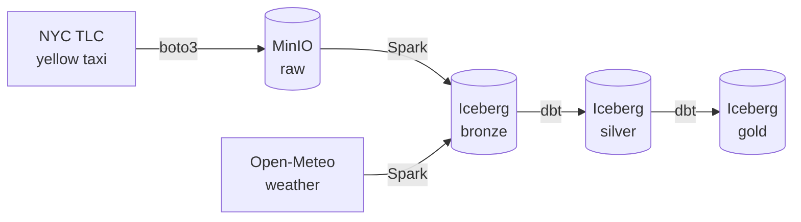

# NYC Taxi & Weather Lakehouse

A batch + streaming data lakehouse that combines **NYC yellow-taxi trip records** with **hourly NYC weather**, built on open table formats. Designed as a **dual-cloud** project: it runs entirely locally on object storage, and mirrors the same architecture on GCP.

No proprietary services required to run the local stack — everything is open source.

## Architecture



The pipeline follows the medallion pattern:

- **Raw** — source files landed untouched in object storage (MinIO locally / GCS on GCP).
- **Bronze** — raw data registered as Apache Iceberg tables (schema-tracked, ACID, time-travel).
- **Silver** — cleaned, typed, and conformed; taxi trips joined to their pickup-hour weather.
- **Gold** — analytics-ready aggregates.

## Tech stack

| Layer | Tool |
|---|---|
| Object storage | MinIO (local) · GCS (cloud) |
| Table format | Apache Iceberg |
| Processing | Apache Spark (PySpark) |
| Transformation | dbt |
| Data quality | Great Expectations |
| Orchestration | Airflow |
| Streaming | Kafka + Spark Structured Streaming |
| Packaging | Poetry |

## Data sources

- **NYC TLC Trip Record Data** — yellow taxi trips, published monthly as Parquet by the NYC Taxi & Limousine Commission.
- **Open-Meteo Historical Weather API** — hourly NYC weather (ERA5 reanalysis). Data licensed **CC BY 4.0**.

## Prerequisites

- macOS or Linux
- Docker (≥ 8 GB allocated)
- Python 3.11
- [Poetry](https://python-poetry.org/) 2.x
- Java 17 (e.g. Temurin) — required by Spark

## Quickstart

```bash
# 1. Start local object storage
docker compose up -d

# 2. Install dependencies
poetry install

# 3. Create the `raw` and `warehouse` buckets
#    in the MinIO console at http://localhost:9001

# 4. Land raw taxi data and register the bronze layer
poetry run python -m lakehouse.ingest_yellow
poetry run python -m lakehouse.build_bronze_yellow

# 5. Land weather as a bronze table
poetry run python -m lakehouse.ingest_weather
```

## Project structure

```
.
├── docker-compose.yml          # local stack (MinIO)
├── pyproject.toml              # dependencies + project metadata
├── .env                        # MinIO credentials (gitignored)
├── data/                       # local scratch for downloads (gitignored)
└── src/lakehouse/
    ├── spark.py                # shared Spark session (Iceberg + MinIO config)
    ├── ingest_yellow.py        # TLC parquet -> MinIO raw bucket
    ├── build_bronze_yellow.py  # raw parquet -> Iceberg bronze table
    └── ingest_weather.py       # Open-Meteo -> Iceberg bronze table
```

## Roadmap

- [x] Local object storage (MinIO)
- [x] Batch ingestion — TLC taxi + Open-Meteo weather
- [x] Bronze Iceberg tables via Spark
- [ ] Silver & gold transformations (dbt)
- [ ] Data quality gates (Great Expectations)
- [ ] Orchestration (Airflow)
- [ ] Streaming variant (Kafka + Spark Structured Streaming)
- [ ] Cloud variant (BigQuery, Pub/Sub, Dataflow)

## License

Code released under the MIT License. Weather data © Open-Meteo, licensed under CC BY 4.0.