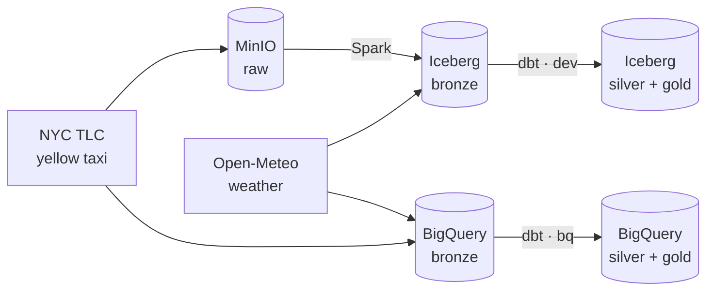

# NYC Taxi & Weather Lakehouse

A medallion-architecture data lakehouse that joins **NYC yellow-taxi trips** with **hourly NYC weather** — and runs *identically* on a fully local open-source stack and on Google Cloud, from one dbt project.

`Spark` · `Iceberg` · `dbt` · `Airflow` · `Great Expectations` · `BigQuery` · `MinIO`

## Overview

The same transformation logic produces the same results on two completely different engines:

- **Local:** raw files land in MinIO, are registered as Apache Iceberg tables via Spark, then transformed by dbt and validated by Great Expectations — all orchestrated by an Airflow DAG.
- **Cloud:** the same data and the same dbt models run on BigQuery.

A single dbt project targets both, with macros bridging the SQL-dialect differences. The two clouds produce row-for-row identical output.

## Architecture



The medallion layers: **raw** (source files, untouched) → **bronze** (registered as tables) → **silver** (cleaned, typed, taxi joined to its pickup-hour weather) → **gold** (analytics aggregates). **Airflow** orchestrates the local pipeline end to end; **Great Expectations** gates the silver layer and fails the run if data quality breaks.

## Key result: weather and tipping

Aggregating one month (January 2024) of trips by the weather at pickup hour:

| Weather | Trips | Avg distance (mi) | Avg fare ($) | Avg tip % (card) |
|---------|------:|------------------:|-------------:|-----------------:|
| clear   | 2,181,830 | 3.33 | 18.56 | 25.8 |
| rain    |   468,783 | 3.16 | 18.14 | 29.0 |
| snow    |   219,390 | 3.19 | 18.51 | 25.5 |

**Riders tip noticeably more in the rain — ~3 points above clear weather** — and it isn't a fare-size artifact: rain trips were slightly *shorter and cheaper*. Snow shows no such bump.

*Caveats (deliberately stated):* this is a single month and correlational, not causal; weather is one city-wide hourly reading applied to every trip in that hour (a production version would join on borough-level weather); and tip percentage is computed over card payments only, since the TLC doesn't record cash tips.

## Tech stack

| Concern | Tool |
|---|---|
| Object storage | MinIO (local) · BigQuery storage (cloud) |
| Table format | Apache Iceberg (JDBC / SQLite catalog) |
| Processing | Apache Spark (PySpark) · BigQuery |
| Transformation | dbt (`dbt-spark` + `dbt-bigquery`) |
| Data quality | Great Expectations + dbt tests |
| Orchestration | Apache Airflow |
| Packaging | Poetry |

## Data sources

- **NYC TLC Trip Record Data** — yellow taxi trips, monthly Parquet.
- **Open-Meteo Historical Weather API** — hourly NYC weather, licensed **CC BY 4.0**.

## Repository structure

```
.
├── docker-compose.yml            # MinIO (local object storage)
├── pyproject.toml                # Poetry: dependencies + metadata
├── spark-conf/                   # Spark defaults for dbt's session (gitignored — holds creds)
├── src/lakehouse/
│   ├── spark.py                  # shared Spark session (Iceberg + MinIO + JDBC catalog)
│   ├── ingest_yellow.py          # TLC parquet -> MinIO raw
│   ├── build_bronze_yellow.py    # raw parquet -> Iceberg bronze
│   ├── ingest_weather.py         # Open-Meteo -> Iceberg bronze
│   ├── validate_silver.py        # Great Expectations quality gate
│   └── load_weather_bq.py        # Open-Meteo -> BigQuery bronze (cloud variant)
├── dbt/
│   ├── profiles.yml              # two targets: dev (Spark/Iceberg) + bq (BigQuery)
│   ├── macros/cross_db.sql       # dialect macros bridging Spark <-> BigQuery SQL
│   └── models/
│       ├── staging/              # stg_yellow, stg_weather
│       ├── silver/               # silver_trips_weather (the join)
│       └── gold/                 # gold_weather_impact
└── dags/lakehouse_pipeline.py    # Airflow DAG orchestrating the local pipeline
```

## Running it

**Prerequisites:** Docker, Python 3.11, Poetry, Java 17 (for Spark). For the cloud variant: a Google Cloud project and the `gcloud` CLU.

**Local:**
```bash
docker compose up -d                 # start MinIO; create `raw` + `warehouse` buckets in the console
poetry install
poetry run python -m lakehouse.ingest_yellow         # raw taxi -> MinIO
poetry run python -m lakehouse.build_bronze_yellow   # -> Iceberg bronze
poetry run python -m lakehouse.ingest_weather        # weather -> Iceberg bronze
SPARK_CONF_DIR=spark-conf poetry run dbt build --project-dir dbt --profiles-dir dbt
poetry run python -m lakehouse.validate_silver       # data-quality gate
```
Or run the whole chain under Airflow by triggering the `lakehouse_pipeline` DAG.

**Cloud (BigQuery):**
```bash
poetry run python -m lakehouse.load_weather_bq       # + bq load the taxi parquet to bronze
poetry run dbt build --target bq --project-dir dbt --profiles-dir dbt
```

## Engineering notes

Real issues solved while building this — the interesting part:

- **MinIO's Community Edition dropped its web console and Docker images in 2025**, so the stack pins a known-good earlier release rather than `latest`.
- **Iceberg's filesystem (`hadoop`) catalog can't reliably list namespaces over object storage**, which broke dbt's startup — migrated to a **JDBC catalog** (SQLite-backed) for proper, queryable catalog semantics, and enabled `jdbc.schema-version=V1` for dbt's view-based table builds.
- **A duplicated Spark config silently wrote a table into the wrong catalog** — fixed by unifying on a single shared `get_spark()` (one source of truth).
- **Airflow runs in its own isolated virtualenv** (its pinned dependencies conflict with dbt/Spark/GE) and shells out to the project's Poetry env via `BashOperator`; tasks are serialized to fit the catalog's single-writer model and the host's RAM.
- **Spark-vs-BigQuery dialect and type differences** are handled with dbt macros (`date_format` ⇄ `format_datetime`); notably, the weather timestamp loads as a `STRING` locally but as a `TIMESTAMP` in BigQuery, requiring per-adapter handling.

## Roadmap

- [x] Local object storage (MinIO)
- [x] Batch ingestion — TLC taxi + Open-Meteo weather
- [x] Bronze Iceberg tables via Spark
- [x] Silver & gold transformations (dbt) with tests
- [x] Data-quality gate (Great Expectations)
- [x] Orchestration (Airflow)
- [x] Cloud variant (BigQuery), same models via dialect macros
- [ ] Streaming variant (Kafka + Spark Structured Streaming)

## License

Code under the MIT License. Weather data © Open-Meteo, CC BY 4.0.